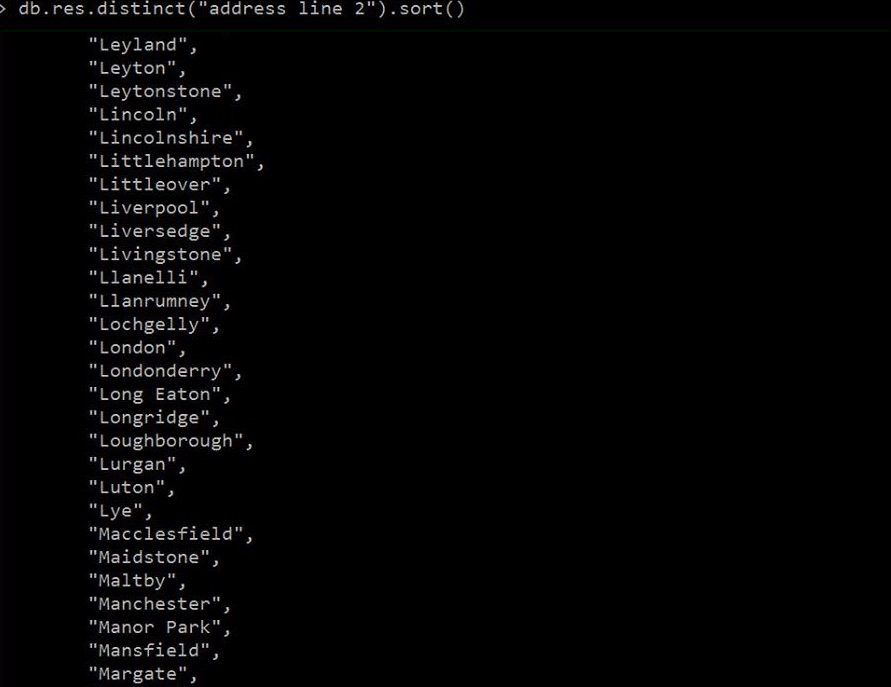
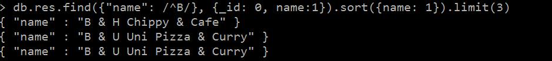
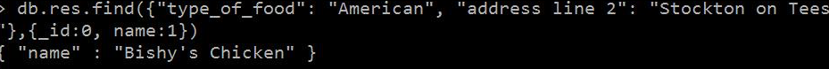
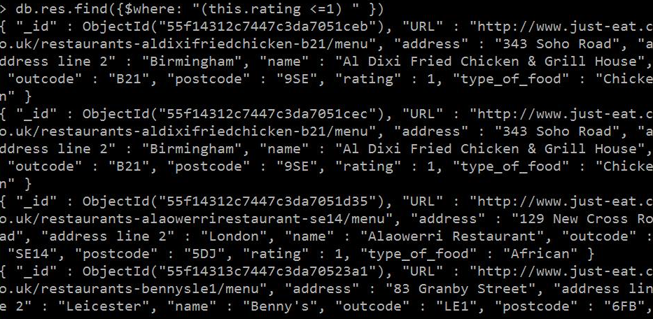
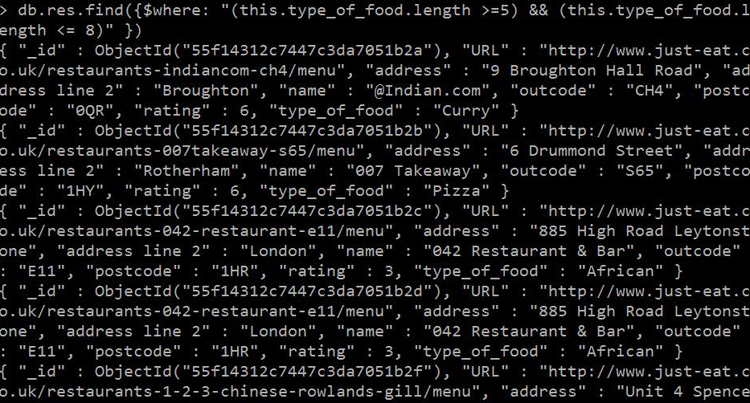
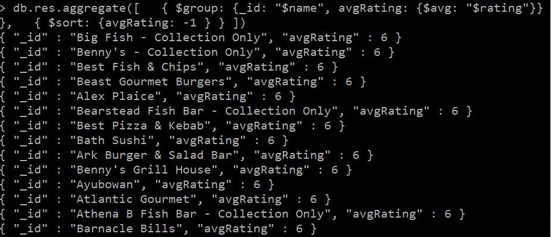
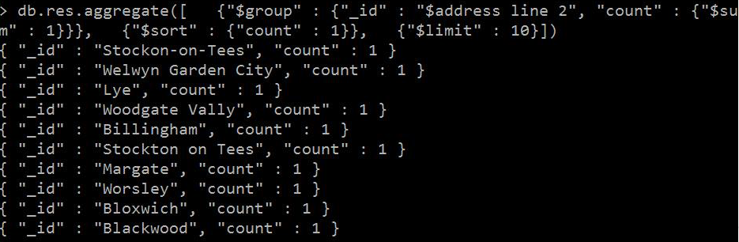
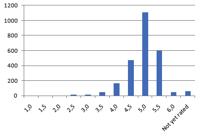
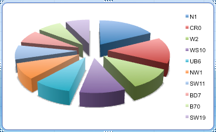
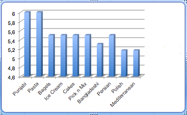

##Egzamin
###Rafał Kupniewski

**Import**

Ponieważ baza Reddit jest bardzo duża i zapytania tam są wykonywane bardzo wolno więc tak jak część moich koleżanek i kolegów postanowiłem posłużyc się bazą restauracji.


Zaimportowanie do bazy MongoDB za pomocą polecenia:

*mongoimport  --db res --collection res --drop --file restauracje.json*

**Wyszukiwanie - lista miejscowosci w ktorych są restauracje(część)**



**Wyszukiwanie restauracji z polskim jedzeniem** :heart:


**Wyszukiwanie z restauracji zaczynajacej sie na literke B**




**Wyszukiwanie restauracji podajacej konkretny typ jedzenia w konkretnym miescie** :angry:



**Javascript**


**Wyszukiwanie z warunkiem restauracji z najgorszym ratingiem** :rage:



**Wyszukiwanie z warunkiem restauracji gdzie typ jedzenia ma miedzy 5 a 8 liter (w sumie nie wiem po co, ale można...)** :confused:



**Agregacja - Restauracje o najwyższej ocenie** :+1:



**Agregacja - Miejscowości najrzadziej odwiedzane** :disappointed_relieved:




__Eksploracja danych__

Grupujemy restauracje wg rankingu poleceniem:

```js
db.res.aggregate(
  [
    {"$group" :
          {"_id" : "$rating", "count" : {"$sum" : 1}}},
          {"$sort" : {"count" : -1}}, {"$limit" : 14}
          ])


{ "_id" : 5, "count" : 1107 }
{ "_id" : 5.5, "count" : 600 }
{ "_id" : 4.5, "count" : 472 }
{ "_id" : 4, "count" : 167 }
{ "_id" : "Not yet rated", "count" : 63 }
{ "_id" : 3.5, "count" : 51 }
{ "_id" : 6, "count" : 49 }
{ "_id" : 3, "count" : 16 }
{ "_id" : 2.5, "count" : 13 }
{ "_id" : 1, "count" : 5 }
{ "_id" : 2, "count" : 3 }
{ "_id" : 1.5, "count" : 2 }
```

**Mamy posortowane dane: ilość restauracji pogrupowanych wg rankingu**

Konwertuje do CVS

| _id            | count     |
|----------------|-----------|
| 5,0            |	1107    |
| 5,5            |	600      |
| 4,5            |	472      |
| 4,0            |	167      |
| Not yet rated  |	63       |
| 3,5            |	51       |
| 6,0            |	49       |
| 3,0            |	16       |
| 2,5            |	13       |
| 1,0            |	5        |
| 2,0            |	3        |
| 1,5            |	2        |

I robimy wykresik



Suma restauracji pod danym adresem.

```js
db.res.aggregate(
[
  {"$group" :
    {"_id" : "$address", "count" : {"$sum" : 1}}},
    {"$sort" : {"count" : -1}},
    {"$limit" : 5}
    ])

{ "_id" : "Unit 23 55-59 Weir Road", "count": 7}
{ "_id" :"14 Market Place" , "count": 6}
{ "_id" :"335 Caledonian Road", "count": 6}
{ "_id" :"5 Circketers Court", "count" : 6}
{ "_id" :"203 Coldharbour Lane", "count" :6 }
```
Suma restauracji w danym mieście? grupowane po kodzie pocztowym

```js
db.res.aggregate(
[
  {"$group" :
    {"_id" : "$outcode", "count" : {"$sum" : 1}}},
    {"$sort" : {"count" : -1}},
    {"$limit" : 10}
    ])

{ "_id" : "N1", "count" : 29 }
{ "_id" : "CR0", "count" : 24 }
{ "_id" : "W2", "count" : 18 }
{ "_id" : "WS10", "count" : 17 }
{ "_id" : "UB6", "count" : 14 }
{ "_id" : "NW1", "count" : 14 }
{ "_id" : "SW11", "count" : 13 }
{ "_id" : "BD7", "count" : 12 }
{ "_id" : "B70", "count" : 12 }
{ "_id" : "SW19", "count" : 12 }
```
I wizualizacja w postaci wykresu:



Wyświetlenie średniego rankingu dla restauracji, wg rodzaju serwowanego jedzenia.
Wynik ten jest nie dokońca "sprawiedliwy" bo największą średnią mają restauracje któych type serwowanego jedzenia występuje niewiele razy.
```js
 db.res.aggregate([
  { $group: {_id: "$type_of_food", avgRating: {$avg: "$rating"}} },
  { $sort: {avgRating: -1 } },
  {$limit : 10}
])
{ "_id" : "Punjabi", "avgRating" : 6 }
{ "_id" : "Pasta", "avgRating" : 6 }
{ "_id" : "Bagels", "avgRating" : 5.5 }
{ "_id" : "Ice Cream", "avgRating" : 5.5 }
{ "_id" : "Cakes", "avgRating" : 5.5 }
{ "_id" : "Pick n Mix", "avgRating" : 5.5 }
{ "_id" : "Bangladeshi", "avgRating" : 5.305555555555555 }
{ "_id" : "Persian", "avgRating" : 5.25 }
{ "_id" : "Polish", "avgRating" : 5.166666666666667 }
{ "_id" : "Mediterranean", "avgRating" : 5.166666666666667 }
```

I wykresik słupkowy



Restauracja, która serwuje jedzenie "Punjabi" jest tylko jedna.
```js
db.res.find({type_of_food: "Punjabi"},{_id: 0, name: 1, type_of_food: 1})

{ "name" : "Abshar Indian Cuisine",
"type_of_food" : "Punjabi" }
```

Restauracji serwująca jedzenie śródziemnomorskie (Mediterranean) jest 12
```js
db.res.find({type_of_food: "Mediterranean"}).count()

12
```
