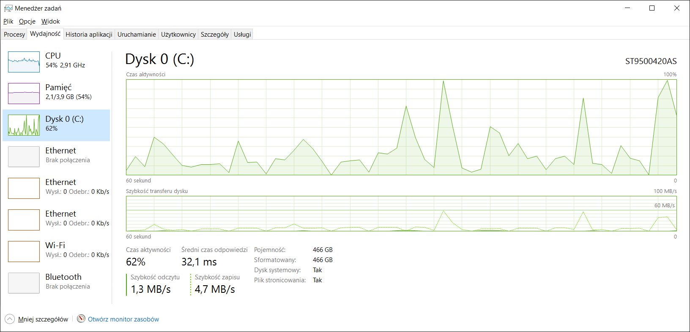

Ćwiczenia zostały wykonane na notebooku Fujitsu Celsius 710H z procesorem i5 pierwszej generacji. System operacyjny Windows 10 x64, dysk twardy standartowy 500 GB, 4GB RAM.

##Zadanie 2a

###MongoDB 3.07 vs Postgress 9.4

#####Pobrany został plik Reddit RC_2015-01.bz2
Plik w celach eksperymentalnych został rozkompresowany do pliku JSON.

Nastepnie plik został zaimportowany do bazy MongoDB i Postgress

Import do bazy MongoDB został wykonany za pomocą polecenia:

<<<<<<< HEAD
```sh
mongoimport  --db test --collection reddit --drop --file RC_2015-01.json
```
=======
``` mongoimport  --db test --collection reddit --drop --file RC_2015-01.json ```
>>>>>>> origin/master


**Czas importu 01:00:43,37**

W celach testowych przeprowadzilem tez import z pliku bz2 za pomocą polecenia:

<<<<<<< HEAD
```sh
bunzip2 -c RC_2015-03.bz2 | mongoimport --drop --host 127.0.0.1 -d baza -c reddit
```
=======
```bunzip2 -c RC_2015-03.bz2 | mongoimport --drop --host 127.0.0.1 -d baza -c reddit```
>>>>>>> origin/master




Widać wyraźnie że wzrosło obciążenie CPU za to wyraźnie widać że spadło obciążenie dysku. Wzrósł także czas importu danych.

**Czas importu 01:27:35,24**


Import do bazy Postgress został wykonany za pomocą zewnetrznego programu Pgfutter ze strony:
(https://github.com/lukasmartinelli/pgfutter)

<<<<<<< HEAD
Składnia polecenia:
```sh
pgfutter_windows_amd64 --db "reddit" --host "localhost" --port "5432" --user "postgres" --pw "martynka" --table "reddit"  json RC_2015-01.json
```
=======
Składnia polecenia: 
```pgfutter_windows_amd64 --db "reddit" --host "localhost" --port "5432" --user "postgres" --pw "martynka" --table "reddit"  json RC_2015-01.json```
>>>>>>> origin/master

(import za pomoca skryptu ( ```node ./bin/postgres-import-json.js``` ) ze linku https://github.com/dzuluaga/postgres-import-json nie powiódł się)


**Czas importu 01:04:25,83**

Wniosek: najwiekszym problemem z szybkością operacji na bazach jest wydajność pamięci masowej. Ani procesor ani pamiec RAM nie jest zbyt mocno obciążana.


##Zadanie 2b

Zliczanie rekordów:

<<<<<<< HEAD
- **MongoDB:**

```sh
db.reddit.count()
```

czas operacji: zerowy, wynik : 53851542

- **Postgres:**  
=======
- ```MongoDB:** *db.reddit.count()```

czas operacji: zerowy, wynik : 53851542

- ```Postgres:**  *select count(*) from import.reddit;```
>>>>>>> origin/master

```sh
select count(*) from import.reddit;
```
**czas operacji : zdążyłem wyjść z psem i zrobić herbatę, wynik : 53851542**


##Zadanie 2c

Polecenie:
<<<<<<< HEAD
```sh
db.reddit.find({author_flair_text:null})*
```
=======
```db.reddit.find({author_flair_text:null}) ```

>>>>>>> origin/master
wynik: 36160298,
czas: 00:14:34.26

Polecenie:
<<<<<<< HEAD
```sh
select count(*) from import.reddit where data->>'author_flair_text' like 'null';
```
=======
```select count(*) from import.reddit where data->>'author_flair_text' like 'null';```
>>>>>>> origin/master

wynik:36160298,
czas:00:13:27.48


---------------------------------


##Wnioski
| PostgreSQL                  | MongoDB           |
|-----------------------------|-------------------|
| :-1: kłopotliwy import           | :+1: prosty import (nawet ze skompresowanego archiwum)   |
| :+1: JSON-y nie są rozbijane na osobne relacje, wszystko ląduje w polu typu JSON   | :-1: trzeba sie nauczyć nowego języka zapytań  |
| :-1: długi czas najprostrzych agregacji | :+1: szybkie zliczenie |
| :+1: z racji popularności łatwiejszy język zapytań | :-1: nieradzenie sobie z agregacjami na tak dużym zbiorze

----------------------------------
##GeoJSON

Importujemy baze miast Polski z pliku "miasta.polski.json". https://github.com/rkupniewski/dbnosql/blob/master/src/miasta.polski.json
za pomocą polecenia:

<<<<<<< HEAD
```sh
mongoimport -d polska -c polska < miasta.polski.json
```
=======
```mongoimport -d polska -c polska < miasta.polski.json```
>>>>>>> origin/master


Dodaje geoindeks poleceniem:

<<<<<<< HEAD
```js
db.polska.ensureIndex({"loc": "2dsphere"})
{
  "createdCollectionAutomatically": false,
  "numIndexesBefore": 1,
  "numIndexesAfter": 2,
  "ok": 1
}
```

Nastepnie wybieram współrzedne Zamoscia [ 23.24852,50.721401] i za pomocą polecenia:

```js
db.polska.find({loc: {$near: {$geometry: {type: "Point", coordinates: [ 23.24852,50.721401]}, $maxDistance: 20000}}}).skip(1).limit(4)
```
=======
```db.polska.ensureIndex({"loc": "2dsphere"})```
```{ ```
```  "createdCollectionAutomatically": false,```
```"numIndexesBefore": 1,```
```  "numIndexesAfter": 2,```
```  "ok": 1```
```}```
```
Nastepnie wybieram współrzedne Zamoscia [ 23.24852,50.721401] i za pomocą polecenia:

```db.polska.find({loc: {$near: {$geometry: {type: "Point", coordinates: [ 23.24852,50.721401]}, $maxDistance: 20000}}}).skip(1).limit(4)```
>>>>>>> origin/master

Otrzymuję z bazy listę czterech najblizszych lokalizacji koło Zamościa wraz ze współrzednymi.

Z ktorej tworzymy [GeoJSON-a](https://github.com/rkupniewski/dbnosql/blob/master/map.geojson) typu Point.

Za pomoca komendy:

<<<<<<< HEAD
```js
db.polska.find({loc: {$geoIntersects: {$geometry: {type: "LineString", coordinates: [[18.68976,54.361118] ,[21.04191,52.23547]]}}}},{_id=0, city:1})
```
=======
```db.polska.find({loc: {$geoIntersects: {$geometry: {type: "LineString", coordinates: [[18.68976,54.361118] ,[21.04191,52.23547]]}}}},{_id=0, city:1})```
>>>>>>> origin/master

Tworzymy dane do otrzymania [GeoJSON-a](https://github.com/rkupniewski/dbnosql/blob/master/map_line.geojson) typu LineString

Poleceniem :

<<<<<<< HEAD
```js
db.p.find({ loc: {$geoWithin : { $geometry: { type : "Polygon", coordinates: [ [[19.91667,50.083328], [22.566669,51.25], [19.02754,50.258419], [19.91667,50.083328]] ] } } }},{_id:0, name:1} ).limit(3)
```
=======
``` db.p.find({ loc:{$geoWithin : { $geometry:{ type : "Polygon", coordinates:[ [[19.91667,50.083328], [22.566669,51.25], [19.02754,50.258419], [19.91667,50.083328]] ]}}}},{_id:0, name:1} ).limit(3)```
>>>>>>> origin/master

Generujemy dane do otrzymania [GeoJSON-a](https://github.com/rkupniewski/dbnosql/blob/master/map_polygon1.geojson) typu Polygon
